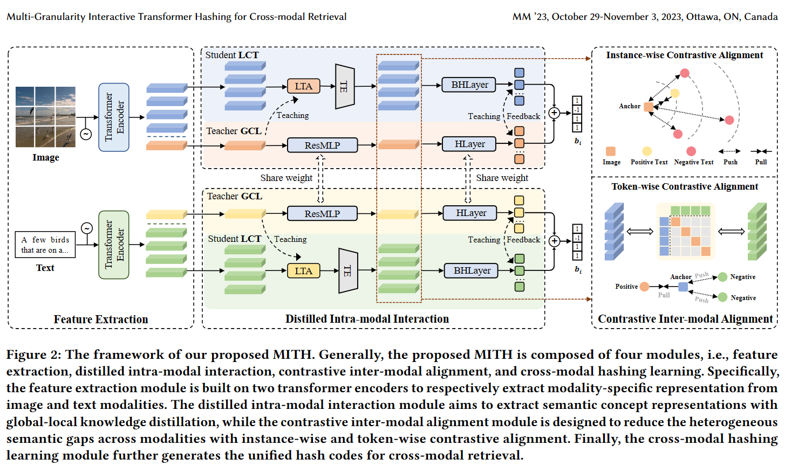
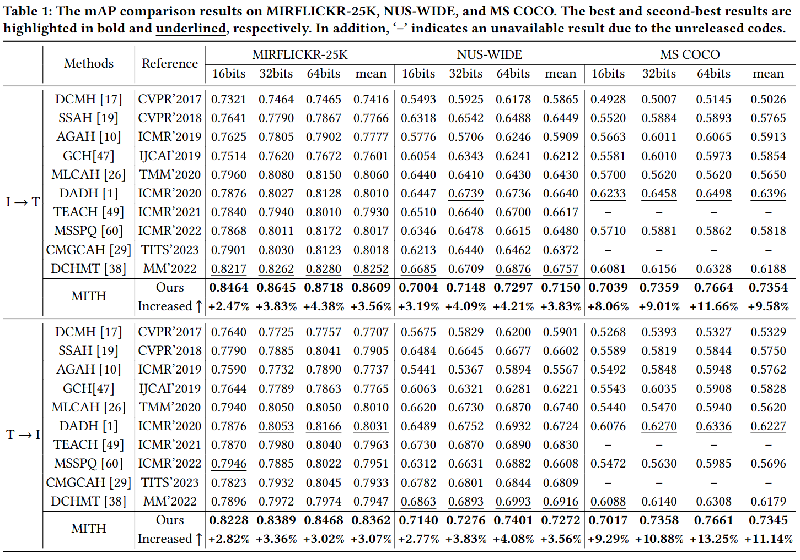

# MITH

# Multi-Granularity Interactive Transformer Hashing for Cross-modal Retrieval


### 1. Introduction

This is the source code of paper "Multi-Granularity Interactive Transformer Hashing for Cross-modal Retrieval".

The main architecture of MITH:



The experimental result:




### 2. Requirements

- python 3.7.16
- pytorch 1.9.1
- torchvision 0.10.1
- numpy
- scipy
- tqdm
- pillow
- einops
- ftfy
- regex
- ...


### 3. Preparation

#### 3.1 Download pre-trained CLIP

Pretrained CLIP model could be found in the 30 lines of [CLIP/clip/clip.py](https://github.com/openai/CLIP/blob/main/clip/clip.py). 
This code is based on the "ViT-B/32". 
You should download "ViT-B/32" and put it in `./cache`, or you can find it from the following link:


link：https://pan.baidu.com/s/1jCYEBhm-bpikAh_Bti139g 
password：9idm


#### 3.2 Generate dataset

You should generate the following `*.mat` file for each dataset. The structure of directory `./dataset` should be:
```
    dataset
    ├── coco
    │   ├── caption.mat 
    │   ├── index.mat
    │   └── label.mat 
    ├── flickr25k
    │   ├── caption.mat
    │   ├── index.mat
    │   └── label.mat
    └── nuswide
        ├── caption.mat
        ├── index.mat 
        └── label.mat
```

Please preprocessing dataset to appropriate input format.

More details about the generation, meaning, and format of each mat file could be found in `./dataset/README.md`.

Additionally, cleaned datasets (MIRFLICKR25K & MSCOCO & NUSWIDE) used in our experiments are available at `pan.baidu.com`:

link：https://pan.baidu.com/s/1jCYEBhm-bpikAh_Bti139g 
password：9idm

### 4. Train

After preparing the python environment, pretrained CLIP model, and dataset, we can train the MITH model.
#### 4.1 Train on MIRFlickr25K
``` 
python main.py --is-train --dataset flickr25k --query-num 2000 --train-num 10000 --result-name "RESULT_MITH_FLICKR" --k-bits 64
```

### 5. Test

#### 5.1 Test on MIRFlickr25K

``` 
python main.py --dataset flickr25k --query-num 2000 --train-num 10000 --result-name "RESULT_MITH_FLICKR" --k-bits 64 --pretrained=MODEL_PATH
``` 

More scripts for training and testing are given at `./run_MITH.sh`. 


### 6. Citation


### 7. Acknowledegements

### 8. Any question

If you have any questions, please feel free to contact Qingpeng Wu (wqp0033@gmail.com).
